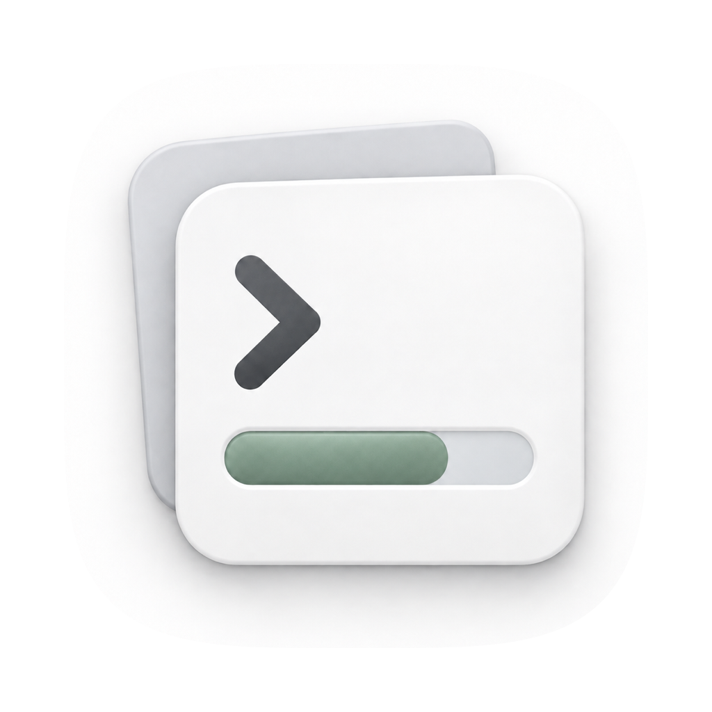

<div align="center">
  
  <h1>TaskBeacon</h1>
  <p><strong>Let AI agents and the long-running jobs they start report real progress.</strong></p>
  <p>macOS menu bar · MCP / CLI · independent background collectors · in-app updates</p>

  <p>
    <a href="README.zh-CN.md">简体中文</a>
    ·
    <a href="https://github.com/pengzhendong/task-beacon/releases">Releases</a>
    ·
    <a href="#quick-start">Quick start</a>
    ·
    <a href="#mcp-integration">MCP</a>
    ·
    <a href="#development-and-releases">Development</a>
  </p>

  <p>
    <a href="https://github.com/pengzhendong/task-beacon/actions/workflows/ci.yml"></a>
    <a href="https://github.com/pengzhendong/task-beacon/releases"></a>
    
    
    <a href="LICENSE"></a>
  </p>
</div>

TaskBeacon is a local-first progress center for AI work on macOS. An agent registers a task when work begins and reports meaningful stage changes as they happen. For training, builds, batch jobs, and other long-running processes, a standalone daemon can keep polling a trusted progress command after the agent's turn has ended.

## Why TaskBeacon?

| Capability | What it does |
| --- | --- |
| **One reporting model** | MCP and CLI share the same register, update, complete, and cancel lifecycle. |
| **Progress after the turn ends** | The daemon can run log parsers, API queries, or SSH commands on an interval without keeping the agent online. |
| **Honest status** | Percentages appear only when a trustworthy total exists; otherwise TaskBeacon shows stage, message, elapsed time, and recent activity. |
| **Task isolation** | Provider, host, session, task, and parent-task identifiers keep concurrent agents and child tasks separate. |
| **Collector health is separate** | A timeout or malformed collector response marks the collector unhealthy without falsely failing the business task. |
| **Crash-safe recovery** | Event deduplication, out-of-order protection, and atomic persistence restore tasks and collectors after a restart. |
| **In-app updates** | Sparkle checks signed GitHub Releases, installs them, and relaunches TaskBeacon automatically. |

## Install

### From a release

Download the latest `TaskBeacon-v*.zip` from [Releases](https://github.com/pengzhendong/task-beacon/releases), extract it, move `TaskBeacon.app` to Applications, and open it. Prebuilt releases currently target Apple Silicon Macs; Intel users can build from source.

After the first install, choose **Check for Updates** from the menu-bar panel or let the daily background check run. Sparkle downloads, verifies, replaces, and relaunches the app automatically. macOS may still request authorization when the application directory is not writable by the current user.

TaskBeacon automatically exposes `taskbeacon` and `taskbeacon-mcp` in `~/.local/bin`. This is a per-user installation and does not require an administrator password. If that directory is not already on your shell path, add this to `~/.zprofile`:

```bash
export PATH="$HOME/.local/bin:$PATH"
```

> [!NOTE]
> Early releases without an Apple Developer ID may trigger macOS's unidentified-developer warning. Update archives are still verified with TaskBeacon's dedicated Ed25519 key. Developer ID signing and notarization are recommended for public distribution.

### From source

```bash
git clone https://github.com/pengzhendong/task-beacon.git
cd task-beacon
make app
open dist/TaskBeacon.app
```

Building requires macOS 13+ and Swift 6. The local app bundle uses an ad-hoc signature and does not require an Apple Developer account.

## Quick start

The menu-bar app starts its bundled local service and links the CLI tools into `~/.local/bin` automatically. The **Install CLI** action remains available to retry or diagnose a conflicting path. Then use it directly:

Register a task, report progress, and complete it:

```bash
taskbeacon register \
  --id demo \
  --title "Index documentation" \
  --project docs \
  --stage "Preparing"

taskbeacon update demo \
  --stage "Indexing" \
  --completed 3 \
  --total 10 \
  --unit files

taskbeacon complete demo \
  --result "Index ready" \
  --target "/path/to/output"

# Remove only TaskBeacon's tracking record; the underlying task keeps running.
taskbeacon forget demo
```

Run `taskbeacon --help` for the complete command entry points. The bundled binary remains available at `/Applications/TaskBeacon.app/Contents/Resources/bin/taskbeacon`.

## MCP integration

The stdio MCP server is bundled at:

```text
/Applications/TaskBeacon.app/Contents/Resources/bin/taskbeacon-mcp
```

For Codex, add the installed STDIO server and verify it:

```bash
codex mcp add taskbeacon -- "$HOME/.local/bin/taskbeacon-mcp"
codex mcp list
```

Codex CLI, the desktop app, and the IDE extension share this MCP configuration. Restart the client after adding it. TaskBeacon also supplies server instructions that tell Codex to register work expected to take more than a minute, report only meaningful changes, and never invent percentages. Other MCP-capable clients can use the bundled server path shown above. The server exposes:

- `task_register`
- `task_update`
- `task_complete`
- `task_cancel`
- `task_list`
- `collector_register`
- `collector_run`

Every update can include an `event_id` for deduplication. When `sequence` is present, an older sequence cannot overwrite a newer state. Events without a sequence use `observed_at` for the same out-of-order protection.

## Background collectors

A collector command writes one JSON object to standard output on every run. Include `progress` only when the total is reliable and its unit remains consistent:

```json
{
  "status": "running",
  "stage": "Training",
  "message": "loss 0.42",
  "progress": {
    "completed": 3200,
    "total": 10000,
    "unit": "step"
  }
}
```

Return `"done": true` when the task has finished. The response may also include `result` and `target`. A terminal status normally pauses the collector. For a long-lived monitor that should keep looking for new work after showing the current task as completed, return `"continuePolling": true` with the terminal status. Register a collector with:

```bash
taskbeacon collector add \
  --id training-log \
  --task training-2026-09-08 \
  --interval 30 \
  --timeout 5 \
  --cwd /path/to/project \
  --command './scripts/read-progress.sh'
```

`--command` is evaluated by `/bin/zsh`. When its value is exactly an existing
script path, TaskBeacon shell-quotes it automatically, so literal paths that
contain spaces work without a wrapper. Commands that include arguments, pipes,
or redirects remain shell source and must use normal shell quoting.

Manage collectors with:

```bash
taskbeacon collector list
taskbeacon collector run training-log
taskbeacon collector pause training-log
taskbeacon collector resume training-log
taskbeacon collector remove training-log
```

The menu shows the current-stage duration, recent activity, and the next collector refresh. Each task card can
also run its collector immediately; long status messages stay compact until expanded.

Executions are single-flight per collector. If a command runs longer than its interval, TaskBeacon waits for it to finish and schedules the next run one interval later. Pausing, removing, or replacing a collector invalidates any in-flight result and stops its collector subprocess when possible.

Collectors do not need their own lock solely to prevent overlapping polls. If a
collector coordinates through an external lock for another reason, make that
lock recoverable: a timeout can terminate the shell before cleanup traps run,
leaving a plain lock file or directory stale.

Collector commands run under the current user's `/bin/zsh`. They should observe work rather than mutate or restart it. Do not put credentials in progress messages or command text; prefer Keychain, restricted environment variables, or an existing CLI login.

## Architecture

| Component | Responsibility |
| --- | --- |
| `TaskBeaconMenu` | SwiftUI menu-bar panel, task groups, progress, collector health, notifications, and update controls |
| `taskbeacond` | Unix-socket service, event processing, JSON persistence, and independent collector scheduling |
| `taskbeacon` | Command-line interface for people, scripts, and agents |
| `taskbeacon-mcp` | JSON-RPC stdio MCP server |
| `TaskBeaconCore` | Shared models, wire protocol, client, and store |

State is stored at `~/Library/Application Support/TaskBeacon/state.json`; the Unix socket is `/tmp/taskbeacon-$UID.sock`. Set `TASKBEACON_DATA_DIR` and `TASKBEACON_SOCKET` for isolated tests or additional instances.

## Development and releases

TaskBeacon requires macOS 13+ and Swift 6. A full Xcode installation is not required for ordinary builds:

```bash
swift build
swift test
make app
```

`make app` creates an ad-hoc-signed `dist/TaskBeacon.app` containing the menu app, daemon, CLI, MCP server, and Sparkle framework.

The application icon uses white stacked task cards, a graphite command prompt, and a muted sage progress bar. The status-item variant is monochrome white on transparency. Panel accents use the open-source Radix Sage, Grass, Amber, and Tomato scales with adaptive light/dark values; see [the palette notes](Assets/PALETTE.md). Run `make icons` to reproduce both icons from `Assets/TaskBeacon.source.png`; see [the icon notes](Assets/ICON.md) for details.

GitHub Actions owns releases. Update the version in `Resources/Info.plist`, then push a matching tag:

```bash
git tag v0.1.0
git push origin v0.1.0
```

The release workflow validates the version, builds and tests every target, packages the app, signs the update with `SPARKLE_PRIVATE_KEY`, generates `appcast.xml` and `SHA256SUMS.txt`, and publishes the GitHub Release. The Sparkle private-key secret is already configured. Developer ID signing and notarization additionally require:

- `MACOS_CERTIFICATE`: Base64-encoded Developer ID Application `.p12`
- `MACOS_CERTIFICATE_PASSWORD`
- `APPLE_ID`
- `APPLE_TEAM_ID`
- `APPLE_APP_PASSWORD`

## Security boundaries

- The local API listens only on a current-user Unix socket; it exposes no TCP port.
- The update feed and update archive are verified with TaskBeacon's dedicated Ed25519 key.
- Task history is capped at 10,000 events and persisted through atomic replacement.
- TaskBeacon does not manage an agent's business credentials or wake arbitrary MCP clients.
- Registering a collector command authorizes execution as the current user; accept collector definitions only from trusted agents and scripts.

## Current scope

The MVP covers local agent reporting, long-running collectors, concurrent and child tasks, restart recovery, system notifications, and in-app updates. Always-on remote collectors, client-specific hooks, and advanced task analytics remain future work.

## License

[Apache License 2.0](LICENSE).
